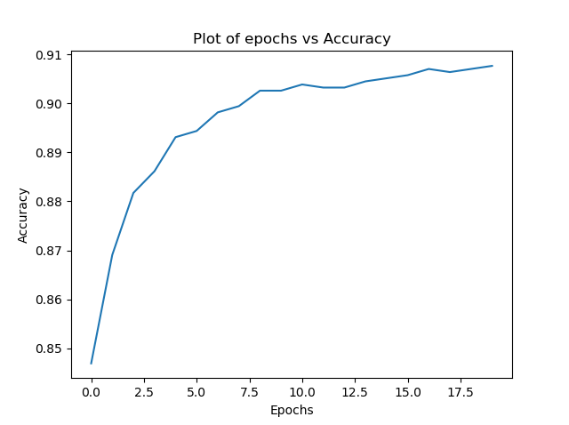

# Perceptron
Various versions of Perceptron 

#### Contributors
1. Omkar Thawakar (Research Assistant, IIT Ropar)
2. Alok Jadhav (pursuing M.S. at University of Utah)

## Directory Structure

    data
    ├── ...
    ├── CVfolds                   # Cross Validation folds
    │   ├── fold1          
    │   ├── fold2
    │   ├── fold3
    │   ├── fold4
    │   └── fold5 
    │
    ├── data_train              # Test Data
    ├── data_test               # Train Data
    ├── libsvm.py               # Read libsvm format
    ├── vocab_index.json        # index of vocabulary words
    └── ...
    
### Perceptron Learning in 2D pattern space (Decision Boundary of Perceptron)


### Learning Analysis (Graph of Epochs vs Accuracy)


### Simple Perceptron
```
python simple_percepton.py
```
###### Output
```
Cross Validation fold ::  fold1
Training folds ::  ['fold2', 'fold3', 'fold4', 'fold5']
For lr 1 accuracy of perceptron is 0.7476340694006309 and No of updates are 5145 .
For lr 0.1 accuracy of perceptron is 0.7570977917981072 and No of updates are 5006 .
For lr 0.01 accuracy of perceptron is 0.7381703470031545 and No of updates are 5036 .
==================================================
...
...
Cross Validation fold ::  fold5
Training folds ::  ['fold1', 'fold2', 'fold3', 'fold4']
For lr 1 accuracy of perceptron is 0.7056962025316456 and No of updates are 5110 .
For lr 0.1 accuracy of perceptron is 0.6993670886075949 and No of updates are 5158 .
For lr 0.01 accuracy of perceptron is 0.689873417721519 and No of updates are 5360 .
==================================================
For lr 1 Maximum Average Accuracy 0.7058559278041768
==================================================
....
....
....
10 words with the highest weights are
observatory
rocket
international
nasa
galaxy
spacecraft
shuttle
orbit
costs
space
==================================================
10 words with the lowest weights are
diseases
health
med
normal
medical
disease
concerned
soon
surgery
msg
==================================================
```

### Average Perceptron

Averaged Perceptron Implement the averaged version of the original Perceptron
algorithm. Averaged variant of the Perceptron asks you to keep two weight vectors (and two bias terms). In addition to
the original parameters (w; b), you will need to update the averaged weight vector a
and the averaged bias ba as:

(a) a = a + w

(b) b_ = b_ + b

This update should happen once for every example in every epoch, irrespective of
whether the weights were updated or not for that example. In the end, the learning
algorithm should return the averaged weights and the averaged bias.


```
python Average_Percepton.py
```

#### Output
```
Cross Validation fold ::  fold1
Training folds ::  ['fold2', 'fold3', 'fold4', 'fold5']
For lr 1 accuracy of perceptron is 0.9211356466876972 with total updates 2153 .
For lr 0.1 accuracy of perceptron is 0.9148264984227129 with total updates 2168 .
For lr 0.01 accuracy of perceptron is 0.9148264984227129 with total updates 2146 .
==================================================
....
....
Cross Validation fold ::  fold5
Training folds ::  ['fold1', 'fold2', 'fold3', 'fold4']
For lr 1 accuracy of perceptron is 0.9018987341772152 with total updates 2116 .
For lr 0.1 accuracy of perceptron is 0.8860759493670886 with total updates 2044 .
For lr 0.01 accuracy of perceptron is 0.8860759493670886 with total updates 2152 .
==================================================
For lr 1 Maximum Average Accuracy 0.8886575090843749
Learning rate :::  1
==================================================
.....
.....
```

### Margin Perceptron

This variant of Perceptron will perform an update on an example (x; y) if y(wTx + b) < margin, where margin is an additional positive
hyper-parameter, specified by the user. Note that because margin is positive, this algorithm
can update the weight vector even when the current weight vector does not make a
mistake on the current example. 

```
python Margin_Perceptron.py
```

#### Output

```
...
...
==================================================
For margin 0.01 we found lr = 1 with Maximum Average Accuracy 0.8930878888312103
...
...
```

### Pocket Perceptron

In many datasets, there is no perfect linear separation, so we
would like to compute the linear separation which correctly classifies the largest number
of examples. The Pocket Perceptron variant approximates this ideal linear separation
by keeping track of the most accurate weight vector found so far (in a pocket) while
continuing to update the weight vector itself. If a better weight vector is found, it
replaces the one currently stored and the algorithm continues to run. 

Implementation of the Pocket Perceptron. As with the Averaged Perceptron, you will need to
keep two weight vectors (and two bias terms). In addition to the original parameters
(w; b), you will need to track the pocket weights and bias (wp; bp). You may also want
to track the number of examples your pocket and your current classifier have classified
correctly. You should use both classifiers to predict every example in every epoch,
and replace the pocket classifier if your current classifier has correctly classified more
examples. In the end, the learning algorithm should return the pocket weights and the
pocket bias.

```
python pocket_perceptron.py
```

#### Output

```
...
...
==================================================
For margin 0.01 we found lr = 1 with Maximum Average Accuracy 0.8930878888312103
...
...
```

