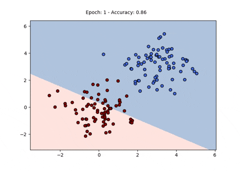

# Perceptron
Various versions of Perceptron 

#### Contributors
1. Omkar Thawakar (Research Assistant, IIT Ropar)
2. Alok Jadhav (MS. University of Utah)

## Directory Structure

    data
    ├── ...
    ├── CVfolds                   # Cross Validation folds
    │   ├── fold1          
    │   ├── fold2
    │   ├── fold3
    │   ├── fold4
    │   ├── fold4
    │   └── fold5 
    │
    ├── data_train              # Test Data
    ├── data_test               # Train Data
    ├── libsvm.py               # Read libsvm format
    ├── vocab_index.json        # index of vocabulary words
    └── ...
    
### Perceptron Learning in 2D pattern space


### Simple Perceptron
```
python simple_percepton.py
```
###### Output
```
Cross Validation fold ::  fold1
Training folds ::  ['fold2', 'fold3', 'fold4', 'fold5']
For lr 1 accuracy of perceptron is 0.7476340694006309 and No of updates are 5145 .
For lr 0.1 accuracy of perceptron is 0.7570977917981072 and No of updates are 5006 .
For lr 0.01 accuracy of perceptron is 0.7381703470031545 and No of updates are 5036 .
==================================================
...
...
Cross Validation fold ::  fold5
Training folds ::  ['fold1', 'fold2', 'fold3', 'fold4']
For lr 1 accuracy of perceptron is 0.7056962025316456 and No of updates are 5110 .
For lr 0.1 accuracy of perceptron is 0.6993670886075949 and No of updates are 5158 .
For lr 0.01 accuracy of perceptron is 0.689873417721519 and No of updates are 5360 .
==================================================
For lr 1 Maximum Average Accuracy 0.7058559278041768
==================================================
....
....
....
10 words with the highest weights are
observatory
rocket
international
nasa
galaxy
spacecraft
shuttle
orbit
costs
space
==================================================
10 words with the lowest weights are
diseases
health
med
normal
medical
disease
concerned
soon
surgery
msg
==================================================
```
